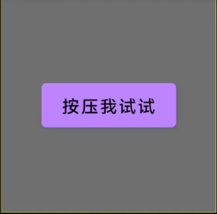
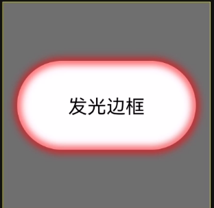

# ComposeUIWidgets

日常积累的一些Compose UI小组件,可以方便以后复用,也欢迎您提交自己的一些UI组件

### 效果一览

### 项目目录介绍

- **samples模块**:示例程序，演示各个组件的使用及效果
- **library模块**:UI组件的实现
  - **extensions**:Modifier扩展,使用方法和标准Modifier扩展方法一致
  - **ui**:单独实现的UI组件
  - **utils**:工具类

### 已有UI组件介绍(使用方法参考samples模块)

|       方法名        |                        效果                        |                                     参数                                      | 贡献者 |
|:------------------:|:-------------------------------------------------:|:----------------------------------------------------------------------------:|:-----:|
|  **PressEffect**   |    |                          minScale:最小的缩放值(0f-1f)                          |   -   |
| **LuminousBorder** |  | shape:边框形状 borderColor:边框颜色 borderWidth:边框宽度 radius:blur半径 |   -   |

