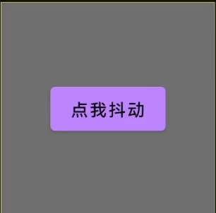
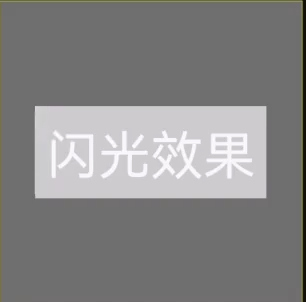
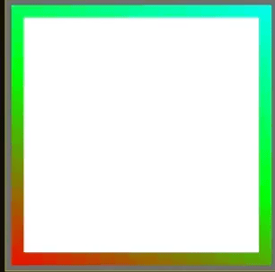
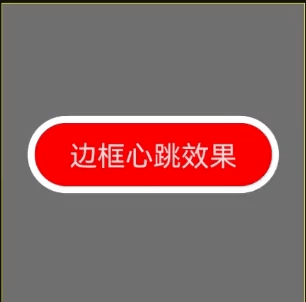
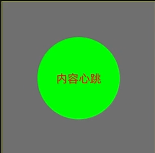
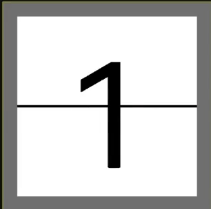
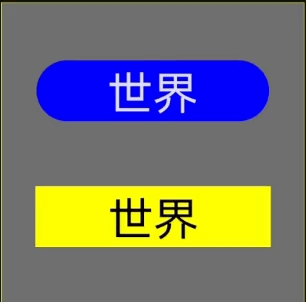

# ComposeUIWidgets

日常积累的一些Compose UI小组件,可以方便以后复用,也欢迎您提交自己的一些UI组件

### 项目目录介绍

- **samples模块**:示例程序，演示各个组件的使用及效果
- **library模块**:UI组件的实现
  - **extensions**:Modifier扩展,使用方法和标准Modifier扩展方法一致
  - **ui**:单独实现的UI组件
  - **utils**:工具类

### 已有UI组件介绍(使用方法参考samples模块)

|          方法名           |                                效果                                | 参数                                                                                                                                                                                                                           | 贡献者 |
|:------------------------:|:-----------------------------------------------------------------:|:-------------------------------------------------------------------------------------------------------------------------------------------------------------------------------------------------------------------------------|:-----:|
|     **PressEffect**      |                    | minScale:最小的缩放值(0f-1f)                                                                                                                                                                                                     |   -   |
|       **Rotation**       |                          | speed 旋转速度,单位圈/秒                                                                                                                                                                                                         |   -   |
|    **ShakingEffect**     |                | animate:动画触发开关，此值改变后触发一次动画 maxDp:抖动的最大距离 duration:动画持续时间 direction:动画方向                                                                                                                       |   -   |
|    **ShinningEffect**    |              | shinningColor:闪光颜色，默认白色 shinningPercent:闪光宽度占比，默认30%，取值范围[0f-1f] duration:一次动画持续时间 默认1500ms delayMillis:两次动画时间间隔 默认300ms skewAngle:闪光倾斜的角度，默认30度 取值范围[0f-360f],顺时针        |   -   |
| **StreamerBorderEffect** |  | borderWidth:边框宽度 borderShape:边框形状 colorList:颜色列表 colorStops:颜色分割列表 tileMode:重复模式                                                                                                                    |   -   |
|  **HeartBeatOfBorder**   |        | expandLength:动画向外扩展的长度 borderShape:边框形状 borderColor:边框颜色 borderWidth:边框宽度 duration:单次跳动持续时间 delayMillis:两次跳动之间的延迟时间 content:包裹内容                                               |   -   |
|  **heartBeatOfContent**  |      | scaleFactor:缩放因数，介于0-1之间 duration:单次跳动持续时间 delayMillis:两次跳动之间的时间间隔                                                                                                                                    |   -   |
|     **FlipTextView**     |                  | fontSize:字号 from:原字符串 to:待动画跳转的字符串 backgroundColor:背景色 textColor:文本颜色 textTypeface:文本字体 dividerColor:中间分隔符颜色 dividerWidth:中间分隔符宽度，传入0dp时为无分割线                            |   -   |
|  **SwitchPageLayout**   |          | modifier switchDirection:页面动画方向 autoSwitch:是否开启自动切换 delayMillis:切换时延，每个页面展示的时间 duration: 切换动画持续时长 onClick: 点击事件回调 content:每个页面的视图，有几个页面就在同一层级定义几个组件，参考Samples |   -   |
|    **LuminousBorder**    |                  | shape:边框形状 borderColor:边框颜色 borderWidth:边框宽度 radius:blur半径                                                                                                                                                  |   -   |

### 效果一览

